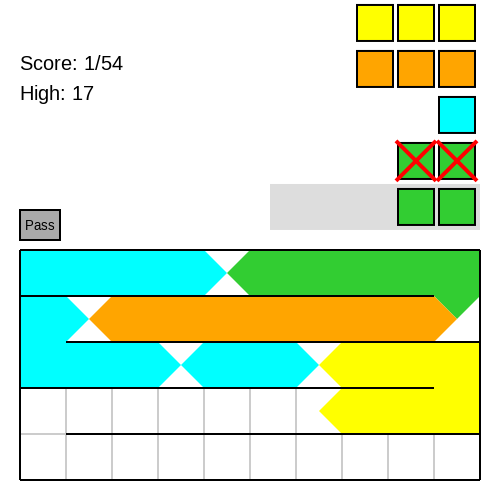
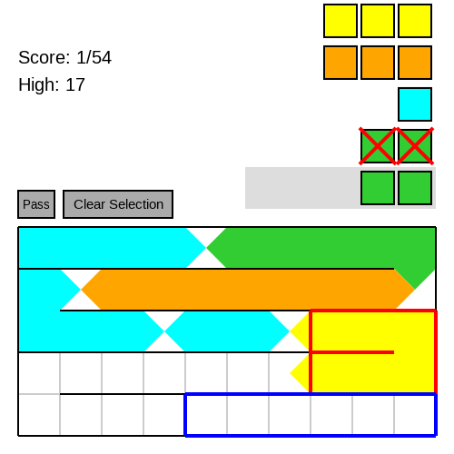
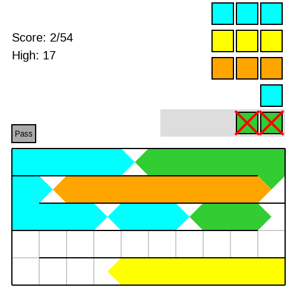
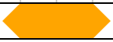
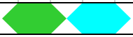

# Defrag Guide

### Click once to begin a selection

### Click again to complete the selection

### Click a third time to select a destination

### Blocks will be moved to the destination

The list in the upper right shows which blocks
will be added or removed after your turn (here two
green were added).

### Two blocks of the same color can sit next to each other

### Two blocks of different colors need a gap

The AI will never give you too many blocks to fit,
but if you have too many gaps, you may run
out of space anyway.  The game ends when this happens.
